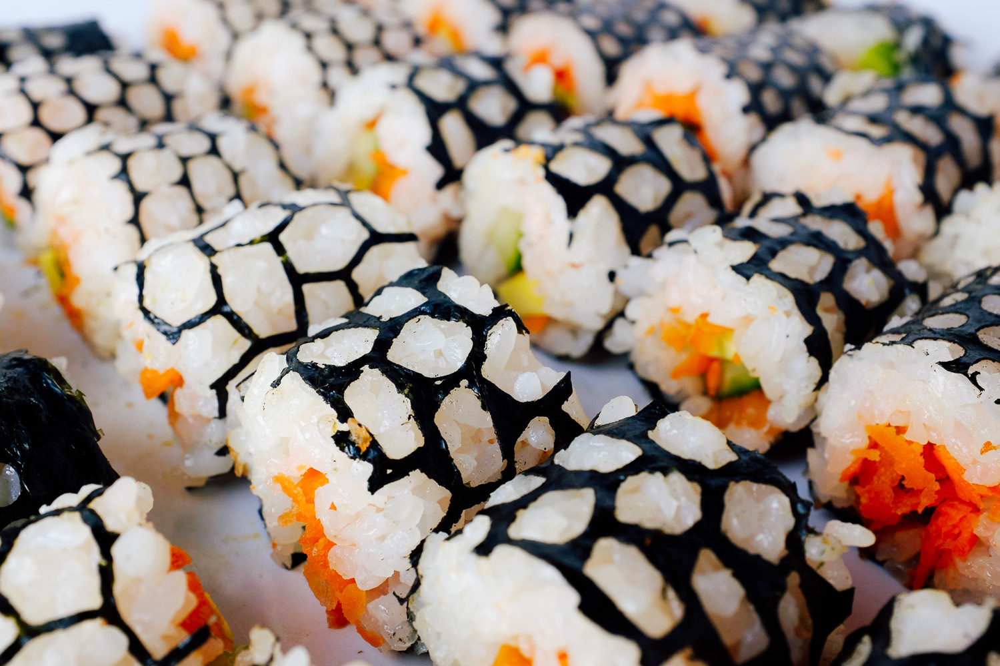

# Laser Sushi

Combining experimental laser-cut aesthetics with a familiar culinary experience.

[Watch the Video](https://www.youtube.com/watch?v=EK5aldxQQDg)

---

In Collaboration with: Skyler Adams

Learning Focus: Culinary Experiences, Food Presentation, Edible Design, Cinematography, Video Editing, Motion Graphics

Media: Sushi, Food, Digital Photograph, Online Video, Motion Graphic

Software: Inkscape, Blender

Hardware: Laser Cutter, Kitchen

Date: November 2015
